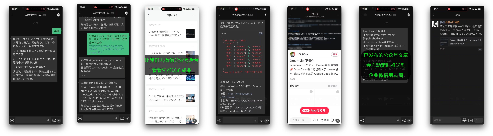
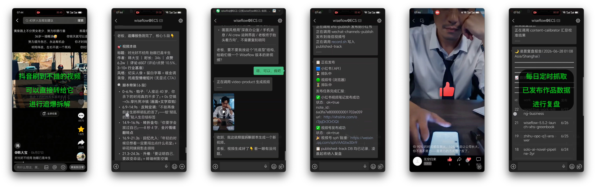

# 小贝（xiaobei）

小贝（xiaobei）是为OPC/中小微企业量身打造的自媒体获客智能体，底层架构基于 [openclaw](https://github.com/openclaw/openclaw)，目前它能帮你：

- 微信公众号文章写作、排版与推送
- 小红书/小绿书图文创作与发布
- 图文海报生成
- 短视频生成与多平台分发（支持视频号、抖音、小红书）
- Twitter/X、微博、知乎等平台发文
- 爆款视频追爆分析、仿写与再创作（支持抖音、B站和小红书视频链接）
- 已发布作品数据监控与每日定时复盘
- 内置小红书、抖音、twitter/x、公众号、视频号平台起号方法论
- 信息搜集与情报：内置 Smart Search，覆盖小红书、抖音、微博、知乎、B站、Twitter、YouTube、视频号、LinkedIn、Reddit、新闻、政务、财经、学术、购物、GitHub 等 18 类信源——无需配置任何 key、纯免费
- 指定信源监控与提取
- 通过社交媒体寻找潜在客户或市场调研
- 灵感记录与思路梳理
- "四声分析"法战略研判与讨论
- 产品deck、ppt制作，投资/IR 材料准备
- 软件著作权、ICP 备案等材料辅助生成
- 闲鱼运营、企业微信朋友圈触达
- ……

并且你只需通过手机上的微信与他沟通，即可实现全部功能！（同时支持飞书、企业微信）





xiaobei 由Wiseflow (原AI首席情报官）作者 bigbrother666sh 开发。

官网：[openclaw-for-business.com](https://openclaw-for-business.com/)

---

## 🚀 **v5.6.0 更新**

- 产品重大重构,更简洁、更易上手、更精炼！
- **重新认识你的 main agent——小贝**：这一版的小贝不再是单一职能的运营助手，而是把此前分散的几个 agent 融合成了一个——
  - **三角色一体**：新媒体运营（self-media-operator）+ 商务拓展（BD, business-developer）+ 投资人关系（IR, investor-relations）合体，外加 sales-cs 生命周期管理。一个微信入口，从内容产出、找客户、到融资材料全包。
  - **新媒体运营面**：多平台发布（公众号/小红书/视频号/抖音/微博/知乎/Twitter/YouTube）、`viral-chaser` 追爆仿写、`content-calibrator` 盲打分+预测、`published-track` 数据复盘、`video-product` 短视频全流程……
  - **商务拓展面**：`lead-hunting` 潜客探索、`comment-engagement` 评论区拓展、`intel-gathering` 情报采集，配 `bd-record`/`info-record` 数据层。
  - **投资人关系面**：`business-model-polish` 商业模式打磨、`project-application` 项目申报（含软著 `swcr-register`）、`investor-pipeline` 投资人发掘与跟进，配 `ir-record` 数据层。
  - **本轮新增起号知识库**：内置 `channels-account-launch-expert`，覆盖抖音、Twitter/X、微信视频号、微信公众号、小红书 5 个平台从 0 起号的运营思路与账号对标技能——没账号、思路乱，先问小贝。
  - **自主协作**：遇到自己搞不定的技术问题（token 过期、登录失效、配置缺失）不喊用户、不停活，自主 spawn IT 工程师修完继续干。
- **浏览器架构重新设计（双线栈）**：
  - **线 1（日常主力）**：forked [camoufox-cli](https://github.com/daijro/camoufox)（vendor 进 `patches/camoufox-cli/`，基于上游 `camoufox-cli@0.6.2` + 三个新功能：`upload` 命令 / fail-first 队列 / `identity export`）走旁路，反指纹 Firefox + JSON-over-unix-socket，绕开 routes/、pw-session、chrome-mcp。无头胜有头，资源占用更少，速度更快，反侦测能力依然在线。
  - **线 2**：保留openclaw原版 `target=host`（existing-session 真机 Chrome + chrome-mcp relay）+ `target=node`（remote-cdp 远端 Chrome）。
  - **profile 丢失 / 损坏 / 指纹错配 → 重建 + 重登录
- 适配 openclaw 2026-6-11 版本（近两个月最稳定版本）、openclaw-weixin 2.4.6 版本。
- 新增一键安装脚本，无需提前配置环境，脚本会搞定一切。

详见 [CHANGELOG.md](CHANGELOG.md)

---

## 🌟 快速开始

### 0. 准备 API Key

推荐注册 [火山引擎方舟 Coding Plan](https://volcengine.com/L/dx-wt80li-I/)（🎁 欢迎使用 xiaobei 邀请链接 / 邀请码 `5Y5A6L86`，订阅叠加 9.5 折，首月尝鲜低至 9.4 元），开通后获得 `AWK_API_KEY`——主力模型 GLM-5.2、视觉与替补模型全部走此通道，**一个 key 即可**。

> ⚠️ **火山方舟 Coding Plan 目前限量发售**，额度通常在每天上午放量，**建议在每天 10 点前购买**更容易抢到。

> 如果习惯使用 ChatGPT / Gemini / Claude 等海外模型见下方[模型费用说明](#-模型费用说明)中的 AiHubMix 备选方案。

> 🎬 **想用视频生成能力？** 需额外开通火山方舟 `doubao-seedance-2.0` 系列或阿里云百炼 `happyhorse-1.1` 系列模型，并把对应 key（`AWK_GEN_KEY` 或 `MODELSTUDIO_API_KEY`）配置到 `daemon.env`。详见下方[视频生成模型配置](#-视频生成模型配置)。

### 推荐：一键脚本安装（预构建 tarball 路线）

一行命令，全程无需预装 Node / pnpm / git（tarball 自带 portable Node + pnpm）。脚本完成后**唯一人工输入**是填 `AWK_API_KEY`（火山方舟 Coding Plan 的 key）。

**国内用户（默认走 atomgit 镜像，免梯子）：** atomgit 仓 `https://atomgit.com/wiseflow/xiaobei` 每晚从上游同步，install.sh 与 release tarball 默认都走 atomgit：

```bash
bash -c "$(curl -fsSL https://atomgit.com/wiseflow/xiaobei/raw/branch/master/scripts/install.sh)"
```

**海外 / 有梯子用户（GitHub，加 `--github` 切回）：**

```bash
bash -c "$(curl -fsSL https://raw.githubusercontent.com/TeamWiseFlow/xiaobei/master/scripts/install.sh)" -s -- --github
```

> install.sh 默认走 atomgit 的 Gitea API 取最新 tag（atomgit 每晚自动同步上游 tag + release），全程不访问 `api.github.com`。指定版本：`export XIAOBEI_TAG=v5.6.0`。自定义镜像：`--mirror <url>` 或 `XIAOBEI_MIRROR=<url>`（自定义镜像请配 `XIAOBEI_TAG` 指定版本）。

**Windows（PowerShell）：**

```powershell
irm https://atomgit.com/wiseflow/xiaobei/raw/branch/master/scripts/install.ps1 | iex
```

> ⚠️ **Windows 必须装 bash**（Git Bash 或 WSL）。install.ps1 用 `tar`（Win10 1803+ 自带）解压 tarball，但 `setup-crew.sh` 是 bash 脚本，部署 crew workspace 离不开 bash。无 bash 时脚本会跳过 crew 模板部署并提示手动补跑——此时小贝团队起不来。装 Git Bash：https://git-scm.com （安装时勾选 "Add to PATH"）。

脚本自动完成（约 5-15 分钟，CI 已预构建引擎，用户侧只 `pnpm install --prod` 拉依赖 + 下 Firefox）：

1. 检测 OS + arch → 选 tarball asset（linux-x64 / mac-arm64 / mac-x64 / win-x64）
2. 下载预构建 tarball → 解压到 `~/xiaobei/`（程序目录：openclaw 引擎 + crew 模板 + 脚本 + portable Node/pnpm + camoufox-cli fork + `bin/openclaw` wrapper）
3. `pnpm install --prod --frozen-lockfile`（用自带的 portable Node + pnpm，在 `openclaw/` 下；只拉依赖不编译，native deps 自动按平台）
4. `pip install --user`（skills 的 Python 依赖）
5. awada 本地插件 deps（`awada/` 下 `npm install --omit=dev` 装 ws+zod）
6. `camoufox-cli install`（下 Firefox 反指纹浏览器二进制，约 557MB，仅首装）
7. `openclaw plugins install @tencent-weixin/openclaw-weixin@<pin> --pin`（微信插件，走 npmmirror）
8. 放 `config-templates/openclaw.json` → `~/.openclaw/openclaw.json` + 预填微信 channel binding
9. `setup-crew.sh`（部署 crew workspace 到 `~/.openclaw/workspace-*`，注册 agents）
10. 交互问 `AWK_API_KEY` → 写 `~/.openclaw/daemon.env` → `openclaw daemon install` + restart
11. 自动出微信绑定二维码（已绑过的机器自动跳过），手机扫码、点确认即用

装好后：

- 脚本最后会自动出微信绑定二维码——用手机微信扫一下、点确认，小贝就能用了。已绑过的机器自动跳过这一步。
- 访问 dashboard：http://127.0.0.1:18789

> **目录职责**：`~/xiaobei/` = 程序（引擎 + 模板 + 脚本 + 工具 + wrapper）；`~/.openclaw/` = 运行数据（openclaw.json + daemon.env + workspaces + logs）。两者分开，升级只换 `~/xiaobei/`，用户数据不动。可用 `XIAOBEI_HOME` / `OPENCLAW_HOME` env 覆盖。

> **系统要求**：推荐 Ubuntu 22.04；支持 WSL2 / macOS（arm64 + x64）；Windows 10 1803+（x64，需 Git Bash 或 WSL）。WSL2 下脚本自动注入 GUI 显示变量。

> **调试模式**（单次启动，适合测试）：`~/xiaobei/bin/openclaw gateway start`

> 排障见 [`docs/install-troubleshooting.md`](docs/install-troubleshooting.md)

### 升级

**已装用户重跑 install 脚本即升级**：脚本检测到 `~/.openclaw/openclaw.json` 已存在时自动走更新路线——只刷新程序目录 `~/xiaobei/`（拉新 tarball + `pnpm install --prod` 重建依赖 + 幂等刷 camoufox/weixin/awada）+ restart gateway，**不碰运行数据**（openclaw.json / workspace / daemon.env 已有 key 全保留）。要强覆盖运行数据加 `--force`（会备份旧 openclaw.json）。

```bash
# 国内（默认 atomgit）
bash -c "$(curl -fsSL https://atomgit.com/wiseflow/xiaobei/raw/branch/master/scripts/install.sh)"
# 海外
bash -c "$(curl -fsSL https://raw.githubusercontent.com/TeamWiseFlow/xiaobei/master/scripts/install.sh)" -s -- --github
```

> 已手动 `git clone` 仓做开发的用户仍可用 `scripts/update.sh` 走 fetch + rebuild 路线（不重装依赖、不卸 daemon）。普通用户用上面的 install 脚本即可。

### 系统与环境要求

| 项目 | 最低要求 | 推荐配置 |
|------|---------|---------|
| CPU | 2 核 | 4 核 |
| 内存 | 8 GB | 16 GB |
| 可用硬盘 | 40 GB | 120 GB |
| 带宽 | 10 Mbps | — |

- **网络**：建议使用正常住宅 IP，数据中心 IP 部分平台可能识别限制。
- 但部分发布能力又需要固定IP（平台限制，非软件能力问题），针对这个矛盾 Wiseflow team 已推出中转服务，具体可以添加下方掌柜二维码详询👇

> **💡 模型费用说明**
>
> xiaobei 底层基于 openclaw，建议先准备好大模型 API：
>
> - **主力模型（强烈推荐）**：[火山引擎方舟 Coding Plan](https://volcengine.com/L/dx-wt80li-I/) — 一个套餐覆盖 GLM-5.2、Kimi-K2.7、MiniMax-M3、DeepSeek-V4 系列、Doubao-Seed-2.0 系列等主流模型，**工具不限**，xiaobei 默认主力模型 GLM-5.2 即走此通道。需要注册并开通 Coding Plan 获得 `AWK_API_KEY`。
>   > 🎁 **通过 xiaobei 邀请链接** [https://volcengine.com/L/dx-wt80li-I/](https://volcengine.com/L/dx-wt80li-I/) **订阅**（邀请码 `5Y5A6L86`），可叠加 **9.5 折**优惠，首月尝鲜低至 **9.4 元**，订得越多折扣越大。
>   > ⚠️ Coding Plan 目前限量发售，建议每天 10 点前购买。
>
> - **海外模型用户**：如果想使用 ChatGPT / Gemini / Claude 等海外模型，可通过 [AiHubMix](https://aihubmix.com/?aff=Gp54) 统一接入（全兼容 OpenAI 接口，国内直连）。欢迎通过此[邀请链接](https://aihubmix.com/?aff=Gp54)注册。备选配置模板见 `config-templates/openclaw-aihubmix.json`。
>
> 配置模板已预置以上最佳实践，`install.sh` 会自动检测所需环境变量并引导你输入。安装后重启 openclaw gateway 即可生效。

> **🎬 视频生成模型配置**
>
> 短视频制作（`video-product`）需额外开通视频生成模型，并把对应 key 配置到 `daemon.env`（任选其一，百炼优先）：
>
> | 平台 | 环境变量 | 模型 |
> |------|---------|------|
> | 阿里云百炼（优先） | `MODELSTUDIO_API_KEY`（或 `DASHSCOPE_API_KEY`） | `happyhorse-1.1-i2v` / `happyhorse-1.1-t2v` / `happyhorse-1.1-r2v` |
> | 火山引擎方舟 | `AWK_GEN_KEY` | `doubao-seedance-2-0-fast-260128` / `doubao-seedance-2-0-260128` / `doubao-seedance-2-0-mini-260615` |
>
> 两个 key 都配了走百炼，只配 `AWK_GEN_KEY` 走火山，都没配则 `video-product` 自动降级为 pexels/pixabay 免费素材模式（也得注册才能获得key，只不过是免费）。注意 `AWK_GEN_KEY` 与主力模型的 `AWK_API_KEY` 是一个 key，但必须在环境变量中以不同变量名称赋值，火山视频生成只认 `AWK_GEN_KEY`。申请成功后可以让小贝喊系统内置的IT Engineer帮你完成配置。

> **🧠 进阶：记忆增强与 dream（可选）**
>
> 默认配置下，小贝的记忆走 FTS 全文检索，已经够用且零额外配置。如果你记忆体量很大、想要更好的语义召回，可以接入一个 embedding 模型；也可以选择打开凌晨"做梦"机制让小贝在夜间整理记忆。
>
> 推荐用 [SiliconFlow](https://cloud.siliconflow.cn/i/WNLYbBpi)（🎁 xiaobei 邀请链接，注册认证后你可获得一张 16 元代金券），它提供 `BAAI/bge-m3` 与 `Qwen/Qwen3-VL-Embedding` 系列，均为 OpenAI 接口格式，可直接配置为 `memorySearch` 的 embedding provider。配置方法：把 `agents.defaults.memorySearch.provider` 从 `"none"` 改为 `"openai-compatible"`，并补上 `remote.baseUrl` / `remote.apiKey` / `model`；想开做梦就把 `plugins.entries.memory-core.config.dreaming.enabled` 改回 `true`。改完重启 gateway 生效。可以让小贝帮你完成配置。

🎉 xiaobei 项目目前提供 **VIP Club**（售价 **168 元/年**），权益包括：

- **付费知识库**：包含《手把手从零开始安装教程》、《安装之后三分钟上手指南》、《Openclaw 自定义配置全案教程》、《Windows 下安装 WSL2 无脑教程》以及各种最佳实践分享
- **vip 微信交流群**，共同探讨交流各种自动化获客玩法，搞钱路上不孤单
- 免费加入 Wiseflow 知识星球
- 每月一次的线上闭门分享（腾讯会议），陪伴你从"小白"到"大神"！
- **会员有效期内免费使用官方中转服务**：涉及小红书、抖音、bili、快手、微信公众号、企业微信朋友圈的技能都需要固定IP（平台要求），一般的家庭网络或办公网络环境并没有固定IP，Wiseflow团队已经搭建了官方的中转服务，vipclub会员期内畅用，不必再单独自建或购买。

此外，我们也面向 VIP Club 会员提供如下增值服务：**远程安装部署、远程技术支持、awada lane 租赁** (需额外付费）

欢迎添加"掌柜的"企业微信（这背后接的就是 xiaobei sales-cs）咨询了解：


🌹 开源不易，感谢支持！

---

## 你的小贝其实不是一个人，而是一支团队

小贝的背后其实是一支 AI 团队，他们有的为小贝提供运维支撑，有的扩增小贝的能力：

| Crew | 职责 | 关键技能 |
|------|------|---------|
| **小贝（main agent）** | AI 搞钱搭子，统筹全局、对接用户、内容选题与发布策略、按需招募/调度其他 crew | 多平台发布（公众号/小红书/视频号/抖音/微博/知乎/Twitter/YouTube）、`viral-chaser` 追爆、`content-calibrator` 打分、`published-track` 复盘、`smart-search` / `lead-hunting` / `intel-gathering` / `market-research` 信息搜集、`rss-reader` 信源监控、投融资与 IR 材料（`pitch-deck` / `investor-*` / `ir-record`）、`swcr-register` 软著、`xianyu-ops` 闲鱼 |
| **IT 工程师（it-engineer）** | 幕后支撑，被其他 crew spawn 协助 | 系统运维与排障、`openclaw.json` / `daemon.env` / cron 配置、`login-manager` 登录管理、平台绑定、ICP 备案、腾讯云/阿里云 CLI、GitHub/issue 追踪 |
| **创作者（content-producer）**(预发布) | 专业内容制作者，承担内容生产线重活 | 视频生产（脚本→素材→TTS→渲染→合成）、网页/落地页/APP 视觉设计... |
| **销售型客服（sales-cs）** | AI 客服，可绑企业微信，客户可以直接用个人微信添加 | 售前咨询、销售推进、客户画像维护、投诉/售后分流 |

### AI 团队的自主协作

小贝团队成员之间可以自主完成协作，而无需用户介入，这也是为什么您只需要一个微信入口就可以完整使用所有功能的原因，这意味着：

Crew 遇到自己不能解决的问题：
  ```text
  1. ❌ 不会停止工作
  2. ❌ 不会喊用户帮忙 （这很傻，不是吗？）
  3. ✅ 自主调用合适的 subagent 协助
  4. ✅ 问题解决后继续原任务
  ```

工作流程：

  假设小贝正在处理内容发布任务，突然遇到 API 调用失败：
  ```text
  [xiaobei] 正在发布文章到微信公众号...
  [xiaobei] 发现错误：access_token expired
  [xiaobei] 判断：这是技术问题，调用 IT Engineer
    └── [it-engineer] 收到协助请求：access_token 过期
    └── [it-engineer] 分析原因：token 刷新机制异常
    └── [it-engineer] 执行修复：重新配置 token 刷新
    └── [it-engineer] 返回结果：问题已解决
  [xiaobei] 收到解决方案，继续发布文章
  [xiaobei] 任务完成
  ```
  用户视角：整个过程用户无感知，Agent 自主完成了问题排查和修复。


## 专业的AI客服无需其他的系统

小贝团队中已包含强大的 AI 客服（sales-cs），您无需再额外购买或部署其他系统。只需要对小贝说："我需要招募一名客服"即可。

小贝团队中的 sales-cs 不仅可以按照预设知识库进行精准回答，同时也具有极高的情商，懂得在回答客户问题的过程中步步为营的推进成交。对客户的诘难式提问，也能妥当应对。


*如需让客户直接用微信添加AI客服，需要注册企业微信并租赁 awada lane*

*详询"掌柜的"👆*

## 🔧 全新的浏览器栈

v5.6.0中，我们几乎重构了OpenClaw原版的浏览器自动化方案（详见 `docs/browser-stack-replacement-spec-2026-07.md`）：

| 项 | 说明 |
|----|------|
| `patches/camoufox-cli/` | **forked camoufox-cli**（vendor 自上游 `camoufox-cli@0.6.2`）+ 三个新功能：`upload` 命令（Playwright `setInputFiles`，发布类技能依赖）/ daemon fail-first 队列（同 session 并发直接 fail，不排队不等待）/ `identity export`（导出 UA + 指纹摘要，对应 `cookies export`）。`build.sh` 全局安装替换 `$PATH` 上的上游版 |
| `patches/browser-camoufox-pivot/` | **001 monolith 拆成 35 个单文件 patch**（`patches/` 子目录，按文件名 sort 顺序应用，降低上游漂移失效面）+ adapter + 测试 ship 在 `files/`。删 sandbox 整条路 + 删 host `local-managed` 分支 + 新增 `target=camoufox` 旁路（默认） |
| `patches/overrides.sh` | **去掉 patchright-core 注入**（playwright-core 保留给 remote-cdp 用）；保留 web_search disable |
| `002-disable-web-search-env-var` | **留**：openclaw 内置 web search 大部分需要申请 api key 甚至海外网络，小贝自带完全免费、零部署的 Smart Search 解决方案 | `OPENCLAW_DISABLE_WEB_SEARCH=1` |
| `007-prefer-camoufox-cli` | **留**（改名）：在 browser 工具描述中提示优先用 camoufox-cli 做浏览器自动化，原 browser 工具仅作兜底 | 无 |

**基于这套浏览器栈，我们沉淀了一批浏览器自动化技能**——这些技能源自我们自 AI 首席情报官项目以来长期积累的浏览器自动化技术经验，覆盖登录、填报、发布、互动、抓取等完整工作流：

| 技能 | 职责 |
|------|------|
| `browser-guide` | 浏览器操作最佳实践总纲——登录墙 / CAPTCHA / lazy-load / paywall / 有头无头场景规则 / eval 用法 |
| `smart-search` | 智能搜索——绕开 openclaw 内置 web search 的 api key 依赖，零部署免费方案 |
| `web-form-fill` | 网络表单填报——从信息搜集到浏览器填报的完整工作流，强制有头模式便于用户随时介入 |
| `login-manager` | 平台登录态管理——5 平台统一有头手动登录、探活规则、中央 cookie+UA 存储约定 |
| 各平台发布/互动 skill | `twitter-post` / `twitter-interact` / `weibo-publish` / `zhihu-publish` / `xhs-publish` / `xhs-content-ops` / `douyin-publish` / `wechat-channels-publish` / `xianyu-ops` / `wx-mp-hunter` / `wx-mp-engagement` 等平台专属浏览器自动化技能 |

这些技能共享同一套 forked camoufox-cli + 持久化 session 机制，登录态在 session profile 里闭环，按场景分离有头/无头模式（登录+填报走有头，自动化操作走无头），靠 session 名字符串约定共享 profile 目录与登录态。

## 目录结构

```
wiseflow/
├── openclaw/              # 上游仓库（git clone，禁止直接修改）
├── crews/                 # Crew 模板（D8 扁平化，权限由 crew-type + ALLOWED_COMMANDS 决定）
│   ├── _template/         # 空白脚手架（创建新模板的起点）
│   ├── main/              # [default] 小贝——新媒体运营 / 创业伴侣，绑 openclaw-weixin
│   ├── it-engineer/       # [built-in] IT 工程师——幕后运维 + 排障 sub-agent
│   ├── content-producer/  # 内容制作者——视频/视觉生产线
│   └── sales-cs/          # 销售型客服——绑 awada，默认禁用，按需招募
├── skills/                # 公共技能（≥2 crew 共用，smart-search / browser-guide / login-manager 等）
├── patches/               # wiseflow 基础补丁
│   ├── *.patch            # git 补丁（按序号顺序应用到 openclaw/）
│   └── overrides.sh       # pnpm 依赖覆盖（如替换 playwright → patchright）
├── config-templates/      # 配置模板（开箱即用的最佳实践）
│   ├── openclaw.json      # 默认配置模板（AWK 主力 + fts-only 记忆 + dream 关）
│   └── openclaw-aihubmix.json  # AiHubMix 海外模型备选模板
├── scripts/               # 工具脚本（详见 scripts/README.md）
│   ├── lib/               # 脚本共享工具（agent-skills.sh 等）
│   ├── install.sh         # 一键安装 + 升级（预构建 tarball 路线，macOS + Linux；重跑即升级，保留 ~/.openclaw）
│   ├── install.ps1        # 一键安装 + 升级（Windows，tarball 路线；需 Git Bash/WSL）
│   ├── update.sh          # 已 git clone 开发用户的升级路线（fetch + rebuild，不重装依赖）
│   ├── dev.sh             # 开发模式启动（前台运行 gateway）
│   ├── setup-crew.sh      # 多 crew 系统安装（同步 markdown + 注入规范，幂等）
│   └── setup-wsl2.sh      # WSL2 环境配置
└── docs/                  # 项目文档
```

运行时数据在 `~/.openclaw/`（openclaw.json、daemon.env、workspaces、sessions、camoufox profile 全在此）；程序在 `~/xiaobei/`（install.sh 解压的预构建 tarball：`openclaw/` 引擎 + `crews/` + `skills/` + `scripts/` + `tools/` portable Node/pnpm + `camoufox-cli/` fork + `bin/openclaw` wrapper）。两者职责分开：升级只换 `~/xiaobei/`，`~/.openclaw/` 用户数据不动。可用 `XIAOBEI_HOME` / `OPENCLAW_HOME` env 覆盖位置。

🌹 即日起为 xiaobei 开源版本贡献 PR（代码、文档、成功案例分享均欢迎），一经采纳，贡献者将获赠 **VIP Club 一年会员**！

## 🛡️ 许可协议

自 4.2 版本起，我们更新了开源许可协议，敬请查阅： [LICENSE](LICENSE)

## 📬 联系方式

有任何问题或建议，欢迎通过 [issue](https://github.com/TeamWiseFlow/xiaobei/issues) 留言。

商务合作（**开放定制开发与 OEM 合作，诚招代理**）请联系"掌柜的"👆，或访问官网：[openclaw-for-business.com](https://openclaw-for-business.com/pricing)。

## 🤝 xiaobei 基于如下优秀的开源项目：

- openclaw(Your own personal AI assistant. Any OS. Any Platform. The lobster way. 🦞) https://github.com/openclaw/openclaw
- camoufox(🦊 Anti-detect browser, Firefox fork — forked camoufox-cli 作为线 1 浏览器主力，vendor 进 `patches/camoufox-cli/`) https://github.com/daijro/camoufox
- Feedparser（Parse feeds in Python） https://github.com/kurtmckee/feedparser
- SearXNG（a free internet metasearch engine which aggregates results from various search services and databases） https://github.com/searxng/searxng
- opencli（A CLI for social media & web platforms — smart-search skill 借鉴了其搜索 URL 模式与平台适配方案） https://github.com/jackwener/opencli
- AiToEarn（多平台自媒体发布工具 — `published-track` 的 18 平台文本/媒体限制规则表与内容校验、twitter 互动操作模式借鉴自此） https://github.com/yikart/AiToEarn
- 文颜(Markdown文章排版美化工具，支持微信公众号、今日头条、知乎等平台。) https://github.com/caol64/wenyan
- Everything Claude Code（Claude Code 全局 skill / rule / agent 集合，wiseflow 的 complex-task 等编排 skill 借鉴了其 blueprint 和 gan-style-harness 的设计思路） https://github.com/affaan-m/everything-claude-code
- awesome-design-md（A curated collection of design systems in markdown format — Designer 内置设计系统库参考了此项目的设计系统结构） https://github.com/VoltAgent/awesome-design-md
- videocut-skills（视频去口误/精剪技能集 — `de-mouth` 技能原汁原味借鉴其口误检测与剪映草稿生成能力） https://github.com/Ceeon/videocut-skills
- cheat-on-content（自媒体打分算法借鉴） https://github.com/XBuilderLAB/cheat-on-content
- agent-skills-launch-pack_（起号方法论知识来源） https://github.com/chenjin-cmd/agent-skills-launch-pack_

## Citation

如果您在相关工作中参考或引用了本项目的部分或全部，请注明如下信息：

```
Author：Wiseflow Team
https://github.com/TeamWiseFlow/xiaobei
```

 国内托管地址：[https://atomgit.com/wiseflow/xiaobei](https://atomgit.com/wiseflow/xiaobei)

## 友情链接

[](https://gitcode.com/atomgit_atomcode)&nbsp;&nbsp;&nbsp;&nbsp;&nbsp;&nbsp;[](https://aihubmix.com/?aff=Gp54)&nbsp;&nbsp;&nbsp;&nbsp;&nbsp;&nbsp;[](https://cloud.siliconflow.cn/i/WNLYbBpi)
